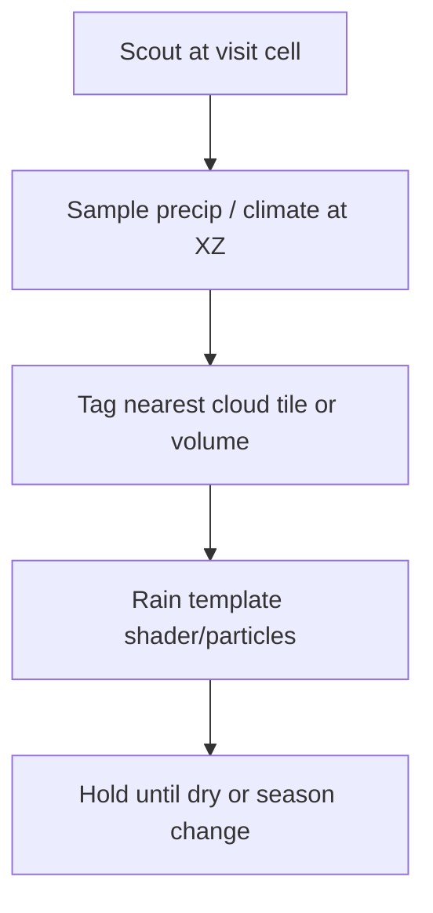

# ValksFuzzyClouds Rain Backlog

**Design-only backlog** — distant rain curtain via scout-sampled precipitation. **Not implemented** in Distant Vistas.

Related: [[Farseer Companion]] · [[User-Mentioned Unfixed]] · [[Neglected Issues Audit]] · [[Distant Vistas]]

## User ask (paraphrase)

Sample precipitation at scout visit cells → tag cloud volumes → render rain template until dry. Intended as companion interaction with **ValksFuzzyClouds** (external mod).

## Status

📋 **Not in repo** — no references to Valks, FuzzyClouds, or precip templates in source.

DV cloud work today:

- `LodCloudHorizon.cs` — Harmony patch on `CloudRenderer` / `FluffyClouds.CloudRendererMap` to stretch cloud tiles to LOD horizon (`HorizonDrawScale` 4.5×).
- No rain particle or precip sampling pipeline.

## Proposed design sketch (unbuilt)

| Step | Open question |
|------|----------------|
| Sample | Which API exposes precip at column? Server vs client? |
| Tag | Map cloud instance IDs across FluffyClouds vs vanilla |
| Template | Material vs particle system — load order with ValksFuzzyClouds |
| Lifecycle | When to clear tag — dry timer, chunk unload, overlay end |

## Why back-burner

1. **External mod** — load order, optional dependency, mod matrix testing.
2. **Scope** — login bake agents focused on [[Login Bake Efficiency]] and [[Farseer Companion]] join quality.
3. **Risk** — rain particle stacking with existing cloud patches.

Listed as 📋 P3 in [[Neglected Issues Audit]] and [[User-Mentioned Unfixed#10. ValksFuzzyClouds distant rain curtain]].

## Mod matrix (to document before implementation)

| Mod | Interaction |
|-----|-------------|
| Farseer | Region shader overlay already patches horizon — rain must not fight `DV_FARSEER_OVERLAY` |
| FluffyClouds | `LodCloudHorizon` patches `CloudRendererMap` |
| ValksFuzzyClouds | Unknown API — scout precip hook TBD |
| Vanilla clouds | 8× VD half-extent vs 4.5× LOD rim |

**Follow-up:** one-page mod matrix doc when a tiny hook appears; no code until then.

## Do-not-duplicate

[[Pipeline - Cursor Agents]] — SIMD/speed agents should not implement this feature.

## References

- `DistantVistas/src/Render/LodCloudHorizon.cs`
- `docs/plans/user-mentioned-unfixed.md` item 10
- `docs/plans/neglected-issues-audit.md` P3 ValksFuzzyClouds
